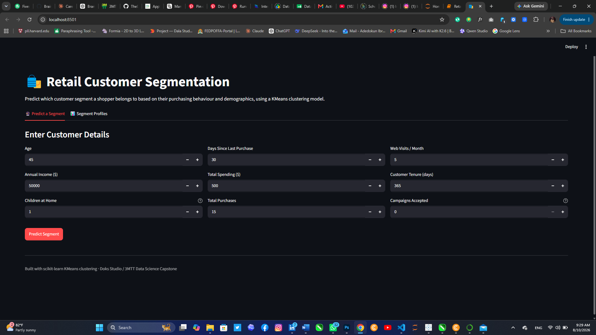
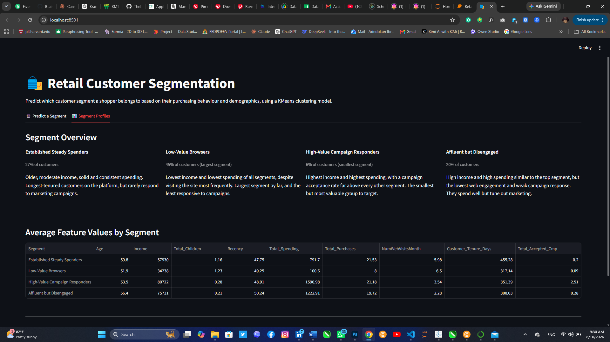
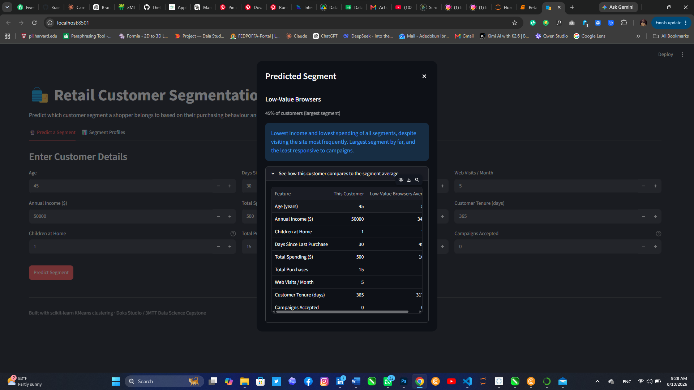

# Retail_Customer_Segmentation
# Retail Customer Segmentation Using KMeans Clustering

Machine learning project that segments retail customers into distinct groups using KMeans clustering on purchasing behaviour and demographic data.

## Project Overview
Customer segmentation groups customers by shared behavioural and demographic traits so a business can target each group differently instead of treating every customer the same way. This project builds a clustering model on 9 behavioural and demographic features, evaluates it statistically, and deploys it as an interactive app that predicts a segment for any new customer.

## Dataset
- **Source:** [Customer Personality Analysis](https://www.kaggle.com/datasets/imakash3011/customer-personality-analysis) (Kaggle)
- **Size:** 2,240 customers × 29 columns
- **Fields:** demographics (Year_Birth, Education, Marital_Status, Income, Kidhome, Teenhome), spending by product category (wines, fruits, meat, fish, sweets, gold), purchase channel (web, catalog, store, deals), campaign response history, and web engagement (Recency, NumWebVisitsMonth)

## Data Cleaning & Feature Engineering
Performed in Python (pandas):
1. Dropped rows with missing `Income` (~1% of rows)
2. Removed extreme outliers in `Age` and `Income`
3. Combined `Kidhome` + `Teenhome` into `Total_Children`
4. Summed all 6 product spending columns into `Total_Spending`
5. Summed all 4 purchase-channel columns into `Total_Purchases`
6. Converted `Dt_Customer` (enrollment date) into `Customer_Tenure_Days`
7. Selected 9 final features and standardised them with `StandardScaler`

**Result:** 2,240 → 2,212 clean customer rows across 9 clustering features.

## Clustering Approach
1. Tested k=2 through k=10 using the elbow method (inertia) and silhouette score
2. Selected **k=4**, based on a genuine local peak in silhouette score and alignment with the elbow bend — chosen over the mathematically higher-scoring k=2 because it produces segments that are behaviourally distinct and independently actionable
3. Fit `KMeans` (k=4) on the scaled features
4. Visualised clusters in 2D using PCA (for inspection only — clustering itself used all 9 features)

## Customer Segments
| Segment | Customers | Avg Income (£/$) | Avg Spending | Avg Purchases | Web Visits/Month | Campaigns Accepted |
|---|---|---|---|---|---|---|
| Established Steady Spenders | 610 (28%) | 57,930 | 791.70 | 21.53 | 5.98 | 0.20 |
| Low-Value Browsers | 1,021 (46%) | 34,238 | 100.60 | 8.00 | 6.50 | 0.09 |
| High-Value Campaign Responders | 128 (6%) | 80,722 | 1,590.98 | 21.18 | 3.54 | 2.51 |
| Affluent but Disengaged | 453 (20%) | 75,731 | 1,222.91 | 19.72 | 2.28 | 0.28 |

## Key Findings & Recommendations
**Established Steady Spenders (610 customers)** — Oldest group with the longest tenure by far (455 days average) and solid, consistent spending, but campaign acceptance is low. *Recommendation:* loyalty-based retention rather than promotional pushes — this group buys steadily without needing to be sold to.

**Low-Value Browsers (1,021 customers)** — The largest segment by a wide margin, with the lowest income and lowest spending (£100.60), yet the highest web visit frequency. They look without buying. *Recommendation:* re-engagement campaigns focused on converting browsing into purchases — e.g. cart-abandonment offers — rather than broad discounting, since they're already the least likely to accept campaigns.

**High-Value Campaign Responders (128 customers)** — The smallest segment, but with the highest income, highest spending, and a campaign acceptance rate (2.51) nearly 10x every other segment. *Recommendation:* prioritise this group for new offers and early access — they convert at a rate no other segment matches.

**Affluent but Disengaged (453 customers)** — Spends nearly as much as the top segment, but has the lowest web engagement and weak campaign response. *Recommendation:* investigate their preferred channel (in-store? loyalty program?) — they're high-value but clearly not being reached through current marketing.

## Model Evaluation
| Metric | Score |
|---|---|
| k (clusters) | 4 |
| Silhouette Score | 0.1979 |
| Calinski-Harabasz Score | 530.11 |
| Davies-Bouldin Score | 1.6912 |

## Tools Used
Python — pandas, scikit-learn (StandardScaler, KMeans, PCA), matplotlib/seaborn · Streamlit (deployment) · joblib (model persistence)

## App Preview

## Files
- [`Retail_Cust_Seg.ipynb`](./Retail_Cust_Seg.ipynb) — full analysis: EDA, cleaning, clustering, evaluation
- [`app.py`](./app.py) — Streamlit app for live segment prediction
- **Live App:** https://retail-customer-segmentation-r8y9.onrender.com
- **Demo Video:** [Add your video link here]

## Author
**Adedokun Ibraheem Kolawole**
3MTT Data Science Fellow · Osun State